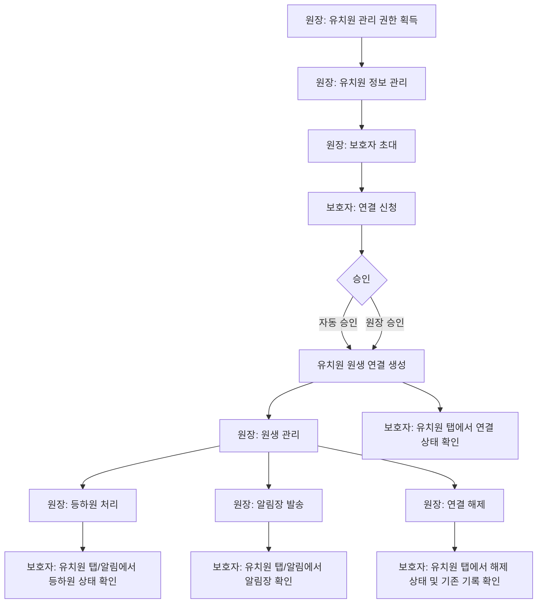

# PRD (1차 MVP)

- 목차

## 1. 개요

### 제품 정의

똑독 v3.0 1차 MVP는 기존 v2.0의 반려견 유치원 탐색 서비스 위에 유치원 관리 기능을 확장해, 원장이 유치원 관리 권한을 얻고 원생을 관리하며, 보호자가 유치원 탭에서 등하원/알림장 등 유치원 생활 정보를 확인할 수 있도록 하는 B2B2C 운영 기능이다.

### 배경

- v2.0은 보호자가 반려견 유치원을 탐색하는 경험을 중심으로 운영 중이다.
- v3.0은 유치원이 서비스 안에서 운영 기록을 만들고, 보호자에게 필요한 정보를 전달하는 구조로 확장한다.
- 1차 MVP는 결제나 예약보다 먼저, 유치원과 보호자가 연결되어 매일의 운영 기록을 주고받을 수 있는 최소 운영 루프를 만드는 데 집중한다.

### 문제 정의와 제공 가치

| 사용자 | 현재 문제 | 1차 MVP 제공 가치 |
| --- | --- | --- |
| 원장 | 보호자 연결, 원생 관리, 등하원 공유, 하루 생활 기록 전달이 여러 채널과 수기 업무로 분산되어 있다. | 유치원 관리 권한 획득 후 원생과 운영 기록을 한 곳에서 관리하고, 보호자에게 필요한 알림을 안정적으로 전달한다. |
| 보호자 | 유치원 생활 정보와 등하원 상태를 일관된 경로로 확인하기 어렵다. | 초대 링크를 통해 유치원에 연결되고, 등하원 알림과 알림장을 앱에서 확인한다. |
| 똑독 | v2.0 탐색 경험만으로는 오프라인 유치원 이용 이후의 서비스 접점과 운영 데이터가 부족하다. | 유치원-보호자 연결과 운영 기록을 기반으로 2차 이용권/예약, 3차 결제 확장의 기반을 만든다. |

---

## 2. 제품 방향

| 항목 | 내용 |
| --- | --- |
| 중심축 | 유치원과 보호자를 연결하는 B2B2C 운영 구조 |
| 1차 MVP 핵심 가치 | 유치원 운영 효율화 |
| 우선 사용자 | 유치원 원장 |
| 보조 사용자 | 보호자 |

### 단계별 MVP 방향

| 단계 | 범위 | 비고 |
| --- | --- | --- |
| 1차 MVP | 유치원 운영 기반, 원아/반려견 정보 관리, 등하원/출석 관리, 알림장, 보호자 알림, 보호자 유치원 경험 | 원장이 유치원 관리 권한을 얻고, 운영 기록을 만들어 보호자에게 전달하며, 보호자는 유치원 탭에서 연결 이후 생활 정보를 확인하는 최소 루프 |
| 2차 MVP | 공지, 이용권 관리/예약 | 공지 기능과, 서비스 내 결제 없이 타 경로로 결제된 이용권을 부여하고 보호자가 그 이용권에 따라 예약하는 방향. 세부 정책은 2차 기획 시 확정 |
| 3차 MVP | 결제 | 서비스 내 결제, 환불, 정산 등 금전 거래 흐름. 세부 정책은 3차 기획 시 확정 |

---

## 3. 사용자와 권한

| 사용자 | 1차 MVP에서의 역할 | 가능 작업 |
| --- | --- | --- |
| 원장 | 보호자 계정 상태에서 특정 유치원의 관리 권한을 획득한 유치원 측 유일한 작업자 | 유치원 관리 권한 획득, 유치원 정보 수정, 보호자 초대, 연결 신청 승인/거절, 원생 조회, 연결 해제, 등하원 처리/취소, 알림장 작성/발송 |
| 보호자 | 초대 링크를 통해 유치원에 연결되고, 연결 이후 유치원 탭에서 생활 정보를 확인하는 사용자 | 보호자 프로필 작성/수정, 반려견 프로필 작성/수정, 유치원 연결 신청, 유치원 탭에서 연결 상태 확인, 등하원 알림 확인, 알림장 확인 |

---

## 4. 1차 MVP 범위

### 포함 범위

| 범위 | 역할 | 완료 기준 |
| --- | --- | --- |
| 유치원 운영 기반 | 보호자 계정 상태의 사용자가 특정 유치원의 관리 권한을 얻고, 이후 유치원 기본 정보를 수정하는 기능 | 원장이 특정 유치원에 대한 관리 권한을 획득하고, 권한 획득 후 해당 유치원의 운영 정보를 확인/수정할 수 있다. |
| 초대/연결 관리 | 원장이 보호자를 초대하고, 보호자가 강아지 단위로 유치원 연결을 신청하는 시작점 | 초대 링크 기반 신청이 가능하고, 신청 건이 자동 승인 또는 원장 수동 승인 대상으로 처리된다. |
| 원생/구성원 관리 | 원장이 현재 연결된 원생을 조회하고, 필요 시 원생 단위로 연결을 해제하는 관리 기능 | 현재 연결 원생을 확인할 수 있고, 연결 해제 시 신규 관리 기능 접근이 차단되며 기존 기록은 보존된다. |
| 원생/반려견 정보 관리 | 유치원 운영 기록의 기준이 되는 원생 정보를 관리하는 기능 | 보호자 반려견 프로필과 별도인 유치원 원생 프로필을 기준으로 운영 기록을 관리할 수 있다. |
| 등하원/출석 관리 | 원장이 등원/하원 상태를 기록하고 보호자에게 즉시 전달하는 기능 | 등원/하원 처리 시 보호자에게 자동 알림이 발송되고, 오입력 취소 시 고정 정정 알림이 발송된다. |
| 알림장 작성/발송 | 원장이 하루 1회 원생별 생활 기록을 작성해 보호자에게 개별 발송하는 기능 | 원장이 원생별 알림장을 작성/임시저장/발송할 수 있고, 발송 후에는 수정/삭제할 수 없다. |
| 알림 | 등하원, 정정, 알림장, 연결 승인/해제 등 보호자와 원장에게 필요한 상태 변화를 전달하는 체계 | 알림 유형별 푸시 발송 여부, 앱 내 알림함 저장 여부, 원본 기록 위치가 정의된다. |
| 보호자 유치원 경험 | 보호자가 유치원 탭에서 연결 상태, 연결된 반려견, 등하원 상태, 알림장 진입을 확인하는 보호자 측 허브 | 보호자는 유치원 연결 상태별 화면을 확인하고, 연결 완료 후 유치원 생활 정보와 관련 상세 화면으로 이동할 수 있다. |

### 제외 범위

| 제외 항목 | 후속 위치 |
| --- | --- |
| 선생님 계정 및 직원 권한 관리 | 1차 MVP 이후 |
| 공지, 이용권 관리/예약 | 2차 MVP |
| 서비스 내 결제, 환불, 정산 자동화 | 3차 MVP 이후 |

---

## 5. 핵심 사용자 흐름

---

## 6. 공통 정책

- 추후 추가

---

## 7. 에픽 구성

[제목 없음](%EC%A0%9C%EB%AA%A9%20%EC%97%86%EC%9D%8C%2037f6c15f67fb81409919cb786e26e859.csv)

---

## 8. 성공 지표

| 구분 | 지표 | 정의 | 측정 방식 | 목표값 | 주기 |
| --- | --- | --- | --- | --- | --- |
| 유치원 운영 기반 | 유치원 관리 권한 획득 완료율 | 관리 권한 획득을 시작한 사용자 중 특정 유치원의 관리 권한을 획득한 비율 | 권한 획득 시작 로그 + 권한 부여 완료 로그 | 추후 확정 | 주간 |
| 연결 | 유치원 연결 신청 완료율 | 초대 링크 진입 후 유치원 연결 신청을 완료한 보호자 비율 | 초대 링크 진입 로그 + 연결 신청 완료 로그 | 추후 확정 | 주간 |
| 운영 | 등원/하원 처리율 | 현재 연결 원생 중 등원 또는 하원 상태가 처리된 원생 비율 | 현재 연결 원생 데이터 + 출석 이력 | 추후 확정 | 일간/주간 |
| 운영 | 등하원 취소/정정 발생률 | 등원/하원 처리 건 중 취소 및 정정 알림이 발생한 비율 | 출석 처리 로그 + 취소/정정 이력 | 추후 확정 | 주간 |
| 알림장 | 알림장 발송 완료율 | 작성된 알림장 중 보호자에게 발송 완료된 비율 | 알림장 작성 로그 + 발송 완료 로그 | 추후 확정 | 일간/주간 |
| 알림장 | 보호자 알림장 열람률 | 발송된 알림장 중 보호자가 열람한 비율 | 알림장 발송 로그 + 열람 로그 | 추후 확정 | 주간 |
| 보호자 유치원 경험 | 유치원 탭 활성 이용률 | 연결 완료 보호자 중 유치원 탭에서 등하원 상태 또는 알림장 진입을 사용한 비율 | 연결 완료 보호자 데이터 + 유치원 탭 방문/CTA 클릭 로그 | 추후 확정 | 주간 |
| 관계 관리 | 연결 해제 후 CS/문의 발생률 | 연결 해제 이후 보호자 또는 유치원 문의가 발생한 비율 | 연결 해제 이력 + CS/문의 기록 | 추후 확정 | 월간 |

---

## 9. 리스크 및 확인 필요 사항

| 구분 | 내용 | 영향 범위 |
| --- | --- | --- |
| 유치원 권한 | 보호자 계정 상태에서 특정 유치원 관리 권한을 얻는 기준과 검증 방식 확정 필요 | 유치원 운영 기반, 권한, 보안, 운영자 검수 |
| 유치원 정보 | 원장이 수정 가능한 유치원 정보의 범위와 수정 승인/검수 필요 여부 확정 필요 | 유치원 운영 기반, 유치원 정보 관리, 기존 v2.0 데이터 |
| 딥링크 | 앱 미설치 보호자가 설치 후 원래 유치원 연결 신청 화면으로 복귀 가능한지 확정 필요 | 초대/연결, 보호자 유치원 등록 |
| SMS QA | Android 제조사/버전별 다중 수신자 SMS 구분자 QA 범위 확인 필요 | 초대/연결 관리 |
| 알림장 필드 | 식사, 배변, 활동, 사진, 특이사항의 필수/선택 여부 확정 필요 | 알림장 작성/발송 |
| 출석 이력 | 연결 해제 후 출석 이력의 열람 범위 확정 필요 | 구성원 관리, 출석, 보호자 화면 |
| 보호자 유치원 탭 IA | 기존 v2.0 보호자 탭 구조 안에서 유치원 탭의 위치, 명칭, 미연결/대기/연결 완료/해제 상태별 화면 확정 필요 | 보호자 유치원 경험, 디자인, 개발, QA |

---

## 10. 변경 이력

| 일시 | 내용 |
| --- | --- |
| 2026-06-14 | 상위 1차 MVP PRD를 핵심 요구사항 중심으로 경량화. 문서 안내, 읽는 순서, 온보딩 체크리스트, 관리용 DB 안내 등은 PRD 밖 별도 문서로 분리. |
| 2026-06-14 | 레거시 PRD 비교 결과를 반영해 문제 정의/제공 가치, 완료 기준, 측정 가능한 성공 지표를 보강. |
| 2026-06-15 | FR-07 보호자 유치원 경험 에픽 추가에 따라 1차 MVP 범위, 보호자 가능 작업, 핵심 사용자 흐름, 성공 지표, 리스크 항목에 보호자 유치원 탭을 반영. |