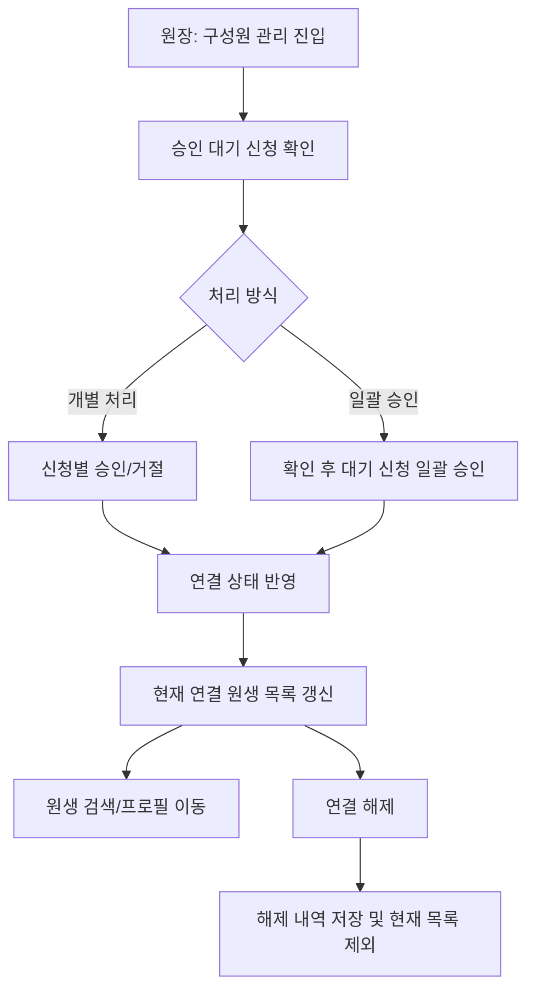

# [FR-01-2] 유치원 연결 승인 및 상태 관리

관련 에픽: [FR-01] 보호자-유치원 연결 관리 (https://app.notion.com/p/FR-01-37f6c15f67fb818f8a3ed091584e1c5c?pvs=21)
적용 MVP: 1차 MVP
문서 상태: 최신
담당: PM_내은, UXUI_원진
진행 단계: 디자인
기획 소요 기간: 2026년 6월 13일
디자인 소요 기간: 2026년 6월 20일
QA 일정: 2026년 7월 13일 → 2026년 7월 16일
배포 예정일: 2026년 6월 22일
위험도: ⚪ 일정 미입력
최종 편집 일시: 2026년 6월 16일 오후 11:17
비고: PRD-FR-006, PRD-FR-009 및 서비스 정책서 기반 초안 작성 완료. 2026-06-14 확정 정책 반영.

## 1. 개요

### 목적

- 원장이 보호자의 유치원 연결 신청을 확인하고, 반려견/원생 단위로 승인 또는 거절할 수 있게 한다.
- 승인된 원생의 현재 연결 상태를 관리하고, 필요 시 연결을 해제할 수 있게 한다.
- 연결 승인, 거절, 해제 이력을 남겨 유치원 운영 데이터의 접근 권한과 상태를 일관되게 관리한다.

### 배경

- `[FR-01-1] 보호자 초대 및 연결 신청`은 보호자가 연결 신청을 생성하는 단계까지 담당한다.
- 본 Feature는 신청 이후 원장의 처리, 현재 연결 원생 목록, 연결 해제, 상태 이력 관리를 담당한다.
- 1차 MVP에서는 교사/선생님 권한을 제외하고 원장만 연결 신청을 처리한다.

### 대상 사용자

| 사용자 | 상태 | 목표 |
| --- | --- | --- |
| 원장 | 유치원 관리 권한 획득 완료 | 보호자의 연결 신청을 처리하고 현재 연결 원생을 관리한다. |
| 보호자 | 유치원 연결 신청 완료 또는 연결 완료 | 연결 승인/거절/해제 결과를 확인하고 권한 상태에 맞게 서비스를 이용한다. |

### 성공 기준

- 원장은 승인 대기 중인 강아지 단위 신청 목록을 확인할 수 있다.
- 원장은 신청 건을 개별 승인/거절하거나 대기 신청을 일괄 승인할 수 있다.
- 원장은 현재 연결된 원생 목록을 조회하고 검색할 수 있다.
- 원장은 원생 단위로 연결을 해제할 수 있으며, 해제 이후 신규 운영 데이터 작성 권한은 차단된다.
- 승인, 거절, 연결 해제 등 주요 상태 변경 이력이 저장된다.

---

## 2. 범위

### 포함 범위

| 범위 | 설명 | 우선순위 |
| --- | --- | --- |
| 승인 대기 신청 목록 | 원장이 승인 대기 연결 신청을 강아지 단위로 확인한다. | Must |
| 개별 승인 | 원장이 신청 건 1개를 승인하고 유치원-원생 연결을 완료한다. | Must |
| 개별 거절 | 원장이 신청 건 1개를 거절 처리한다. | Must |
| 일괄 승인 | 대기 중인 신청을 한 번에 승인한다. | Must |
| 현재 연결 원생 목록 | 원장이 현재 유치원에 연결된 원생 목록과 전체 원생 수를 확인한다. | Must |
| 원생/보호자 검색 | 강아지 이름 또는 보호자 이름으로 현재 연결 목록을 필터링한다. | Must |
| 원생 프로필 이동 | 연결된 원생 항목에서 원생 프로필로 이동한다. | Must |
| 연결 해제 | 원장이 특정 원생의 유치원 연결을 해제한다. | Must |
| 연결 해제 내역 | 연결 해제된 원생의 최소 표시 정보를 이력으로 확인한다. | Must |
| 상태 변경 이력 | 승인, 거절, 연결 해제의 처리자, 처리 일시, 대상 정보를 기록한다. | Must |

### 제외 범위

| 제외 항목 | 제외 사유 | 후속 위치 |
| --- | --- | --- |
| 교사/선생님 연결 승인 | 1차 MVP에서는 원장만 유치원 운영자로 둔다. | 1차 MVP 이후 |
| 보호자 자진 연결 해제 | 원장 관리 화면 중심의 1차 MVP 범위를 벗어난다. | 확인 필요 또는 후속 정책 |
| 일괄 연결 해제 | 오조작 시 영향 범위가 크고 MVP 핵심이 아니다. | 후속 검토 |
| 해제 사유 입력 | 운영 부담이 증가하므로 1차 MVP에서는 제외한다. | 운영 리스크 증가 시 재검토 |
| 해제된 원생 상세 프로필 조회 | MVP에서는 해제 이력 최소 정보만 제공한다. | 민감정보 노출 정책 확정 후 검토 |
| 해제 후 알림장/갤러리 수정·삭제 | 기존 기록은 읽기 전용으로 유지한다. | 운영자 검토 정책 |

---

## 3. 사용자 흐름

---

## 4. 상태 정의

| 상태 | 정의 | 주요 동작 |
| --- | --- | --- |
| 승인 대기 | 보호자가 연결 신청을 제출했으나 아직 승인/거절되지 않은 상태 | 원장 승인/거절 대상 |
| 연결 완료 | 원장 승인으로 유치원-원생 연결이 성립된 상태 | 원장 관리 기능과 보호자 열람 권한 개방 |
| 거절 | 원장이 연결 신청을 거절한 상태 | 해당 신청은 종료되며, 보호자는 링크 재접속을 통해 재신청 가능 |
| 연결 해제 | 기존 연결이 원장에 의해 종료된 상태 | 신규 운영 데이터 작성 권한 차단, 기존 기록은 읽기 전용 유지 |

---

## 5. 기능 요구사항

| ID | 요구사항 | 상세 | 우선순위 |
| --- | --- | --- | --- |
| KD-FR-CONN-001 | 승인 대기 목록 조회 | 원장은 현재 유치원의 승인 대기 신청을 강아지 단위로 조회할 수 있다. | Must |
| KD-FR-CONN-002 | 신청 행 표시 | 신청 목록은 보호자명, 강아지명, 신청 상태를 기준으로 표시한다. | Must |
| KD-FR-CONN-003 | 개별 승인 | 원장은 대기 신청 1건을 승인할 수 있다. | Must |
| KD-FR-CONN-004 | 개별 거절 | 원장은 대기 신청 1건을 거절할 수 있다. | Must |
| KD-FR-CONN-005 | 개별 처리 확인 팝업 생략 | 개별 승인/거절은 제한된 진입 경로와 사후 연결 해제 가능성을 고려해 확인 팝업을 생략한다. | Must |
| KD-FR-CONN-006 | 일괄 승인 | 원장은 대기 중인 신청 전체를 일괄 승인할 수 있다. | Must |
| KD-FR-CONN-007 | 일괄 승인 확인 | 일괄 승인은 다건 처리 액션이므로 실행 전 확인 Alert를 노출한다. | Must |
| KD-FR-CONN-008 | 원생 정보 생성 트리거 | 승인 완료 시 보호자 반려견 프로필을 기반으로 유치원 운영용 원생 정보 생성을 트리거한다. | Must |
| KD-FR-CONN-009 | 현재 연결 원생 목록 조회 | 원장은 현재 연결 상태의 원생 목록과 전체 원생 수를 확인할 수 있다. | Must |
| KD-FR-CONN-010 | 원생/보호자 검색 | 원장은 강아지 이름 또는 보호자 이름으로 연결 원생 목록을 검색할 수 있다. | Must |
| KD-FR-CONN-011 | 원생 프로필 이동 | 원장은 연결 원생 항목에서 원생 프로필로 이동할 수 있다. | Must |
| KD-FR-CONN-012 | 연결 해제 확인 | 연결 해제 선택 시 해제 후 중단되는 기능과 유지되는 기록을 안내하는 확인 팝업을 제공한다. | Must |
| KD-FR-CONN-013 | 연결 해제 처리 | 원장이 확인하면 해당 원생의 유치원 연결을 해제하고 현재 연결 목록에서 제외한다. | Must |
| KD-FR-CONN-014 | 연결 해제 내역 조회 | 원장은 연결 해제된 원생의 최소 표시 정보를 이력으로 확인할 수 있다. | Must |
| KD-FR-CONN-015 | 상태 변경 이력 저장 | 승인, 거절, 연결 해제의 대상, 처리자, 처리 일시를 저장한다. | Must |
| KD-FR-CONN-016 | 상태 변경 알림 트리거 | 승인, 거절, 연결 해제 시 보호자에게 알림 발송 이벤트를 생성한다. 상세 발송 정책은 알림 Feature PRD를 따른다. | Must |

---

## 6. 정책

| 정책 | 내용 |
| --- | --- |
| 처리 권한 | 본인 유치원에 매핑된 원장만 해당 유치원의 연결 신청을 승인/거절/해제할 수 있다. |
| 연결 단위 | 연결 신청, 승인, 거절, 해제는 모두 반려견/원생 단위로 처리한다. |
| 다견 보호자 | 한 보호자가 여러 마리를 신청한 경우 각 반려견은 별도 신청 행과 별도 연결 상태를 가진다. |
| 개별 처리 | 개별 승인/거절은 확인 팝업 없이 즉시 처리한다. |
| 일괄 승인 | 일괄 승인은 처리 대상 수를 표시하고 확인 Alert 이후 실행한다. |
| 거절 후 재신청 | 거절은 영구 차단이 아니며, 보호자는 초대 링크 재접속을 통해 다시 신청할 수 있다. |
| 연결 해제 영향 | 연결 해제 후 유치원은 해당 원생의 신규 알림장 작성, 신규 미디어 업로드, 운영 관리 기능에 접근할 수 없다. |
| 기존 기록 유지 | 연결 해제 전 생성된 알림장과 미디어는 유치원과 보호자 양측이 읽기 전용으로 계속 열람할 수 있다. |
| 기존 기록 수정 제한 | 연결 해제 후 기존 알림장과 미디어는 수정/삭제할 수 없다. 단, 개인정보 노출, 오등록, 법적 삭제 요청 등은 운영자 검토 후 별도 조치한다. |
| 재연결 | 동일 원생과 동일 유치원이 초대 링크를 통해 재연결될 경우 기존 기록은 이어진다. |

---

## 7. 예외 및 엣지 케이스

| 상황 | 발생 조건 | 시스템 동작 | 사용자 안내 |
| --- | --- | --- | --- |
| 승인 대기 신청 없음 | 승인 대기 신청 0건 | 승인 대기 영역 빈 상태 노출, 일괄 승인 비활성화 | 승인 대기 중인 신청이 없어요. |
| 일괄 승인 대상 없음 | 대기 신청 0건 상태에서 일괄 승인 접근 | 일괄 승인 버튼 Disabled | 별도 메시지 없음 |
| 일괄 승인 일부 실패 | 일괄 승인 API 일부 실패 | 성공 건은 연결 완료 유지, 실패 건은 대기 상태 유지 | 일부 신청을 승인하지 못했습니다. 다시 시도해 주세요. |
| 동시 처리 | 동일 신청이 이미 처리된 뒤 중복 요청 발생 | 현재 상태 재조회 후 최신 상태 기준으로 표시 | 이미 처리된 신청입니다. |
| 연결된 원생 없음 | 현재 연결 원생 0명 | 현재 연결 목록 빈 상태 노출 | 연결된 원생이 없어요. |
| 검색 결과 없음 | 강아지 이름 또는 보호자 이름 검색 결과 0건 | 검색 결과 빈 상태 노출 | 검색 결과가 없어요. |
| 연결 해제 취소 | 확인 팝업에서 취소 선택 | 해제 요청 미실행, 기존 목록 유지 | 별도 메시지 없음 |
| 연결 해제 실패 | API 오류 또는 네트워크 오류 | 연결 상태 유지, 해제 내역 미생성 | 연결 해제에 실패했습니다. 다시 시도해 주세요. |
| 이미 해제된 원생 | 동일 원생에 대해 중복 해제 요청 | 상태 재조회 후 해제 상태 유지 | 이미 연결 해제된 원생입니다. |
| 해제 내역 없음 | 연결 해제 이력 0건 | 해제 내역 빈 상태 노출 | 연결 해제 내역이 없어요. |

---

## 8. 데이터 요구사항

| 항목 | 필수 | 설명 |
| --- | --- | --- |
| 연결 신청 ID | Y | 보호자가 제출한 신청 건 식별자 |
| 유치원 ID | Y | 처리 대상 유치원 식별자 |
| 원생/반려견 ID | Y | 승인/거절/해제의 기준 단위 |
| 보호자 사용자 ID | Y | 신청한 보호자 계정 식별자 |
| 연결 상태 | Y | 승인 대기, 연결 완료, 거절, 연결 해제 등 현재 상태 |
| 처리자 ID | 조건부 | 원장 승인/거절/해제 시 처리자 계정 ID |
| 처리 일시 | 조건부 | 승인, 거절, 연결 해제 완료 시각 |
| 연결 일시 | 조건부 | 연결 완료 상태가 된 시각 |
| 연결 해제 일시 | 조건부 | 연결 해제 상태가 된 시각 |
| 해제 내역 표시 스냅샷 | N | 해제 내역 표시용 원생명, 보호자명 일부 또는 마스킹 연락처 등 최소 정보 |
| 상태 변경 이력 | Y | 상태 변경 대상, 이전 상태, 이후 상태, 처리자, 처리 일시 |

---

## 9. 시스템 메시지

| 상황 | 타입 | 문구 |
| --- | --- | --- |
| 승인 대기 없음 | Empty | 승인 대기 중인 신청이 없어요. |
| 승인 완료 | Toast | 승인 완료되었습니다. |
| 거절 완료 | Toast | 거절 완료되었습니다. |
| 일괄 승인 확인 | Alert | 연결 신청 N건을 모두 승인할까요? |
| 일괄 승인 완료 | Toast | 연결 신청 N건 승인 완료되었습니다. |
| 일괄 승인 일부 실패 | Toast | 일부 신청을 승인하지 못했습니다. 다시 시도해 주세요. |
| 현재 원생 목록 없음 | Empty | 연결된 원생이 없어요. |
| 검색 결과 없음 | Empty | 검색 결과가 없어요. |
| 연결 해제 확인 | Alert | 연결을 해제하면 해당 원생의 새 알림장과 갤러리를 작성할 수 없습니다. 정말 연결을 해제하시겠습니까? |
| 연결 해제 완료 | Toast | 연결이 해제되었습니다. |
| 연결 해제 실패 | Toast | 연결 해제에 실패했습니다. 다시 시도해 주세요. |
| 이미 해제된 원생 | Toast | 이미 연결 해제된 원생입니다. |
| 해제 내역 없음 | Empty | 연결 해제 내역이 없어요. |

---

## 10. 확인 필요 사항

| 항목 | 확인 필요 내용 | 영향 범위 |
| --- | --- | --- |
| 보호자 자진 연결 해제 | 서비스 정책서에는 보호자발 연결 해제가 있으나, 1차 MVP 원장 관리 범위에 포함할지 확인 필요 | 권한, 보호자 UX, 알림 |
| 거절 후 재신청 제한 | 거절 후 즉시 재신청을 허용하되, 반복 신청 제한 기준이 필요한지 확인 필요 | 운영, 제재 정책 |
| 원생 정보 생성 범위 | 승인 시 반려견 프로필에서 어떤 항목을 원생 정보로 복사할지 세부 기준은 원생/반려견 정보 관리 PRD에서 확정 필요 | 원생 정보, 개발 |
| 알림 채널 | 승인/거절/해제 알림의 푸시/알림함 저장 방식은 알림 발송 정책 및 앱 내 알림함 정책에서 최종 확정 필요 | 알림, QA |
| 해제 후 기존 기록 범위 | 읽기 전용 유지 대상에 알림장 외 어떤 미디어/리포트가 포함되는지 최종 확인 필요 | 데이터 접근, 운영 |

---

## 11. 원본 및 변경 반영

| 구분 | 내용 |
| --- | --- |
| 참고 원본 | PRD-FR-006 초대/연결 관리, PRD-FR-009 구성원 관리, 서비스 정책서 |
| 반영 변경 | 초대/신청 생성은 \[FR-01-1\]로 분리. 본 문서는 신청 이후 승인/거절, 현재 연결 원생 목록, 연결 해제, 상태 이력 관리에 집중. 교사/선생님 연결 제외. |
| 작성일 | 2026-06-14 |