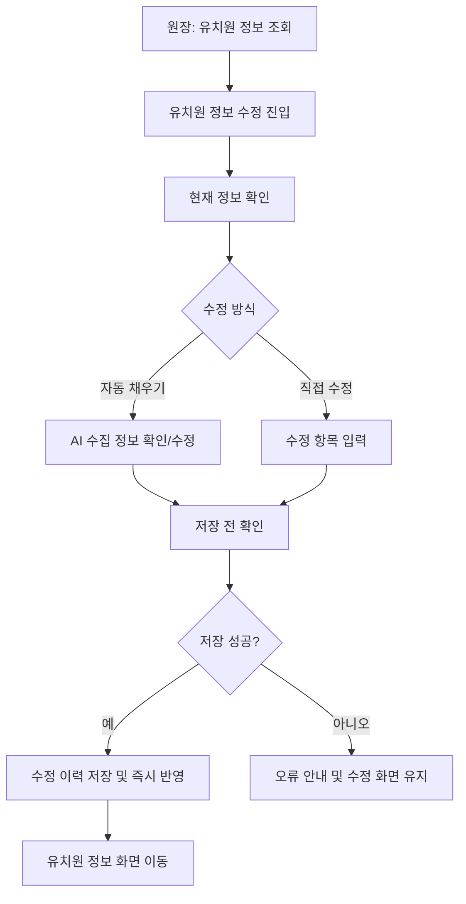

# [FR-02-2] 유치원 정보 관리

관련 에픽: [FR-02] 유치원 운영 기반 (https://app.notion.com/p/FR-02-37f6c15f67fb81dfa3a4fbc4310ee8ea?pvs=21)
적용 MVP: 1차 MVP
문서 상태: 최신
담당: PM_내은, UXUI_예솔
진행 단계: 디자인
기획 소요 기간: 2026년 6월 10일
디자인 소요 기간: 2026년 6월 14일
QA 일정: 2026년 7월 13일 → 2026년 7월 16일
배포 예정일: 2026년 6월 22일
위험도: ⚪ 일정 미입력
최종 편집 일시: 2026년 6월 16일 오후 12:49
비고: PRD-FR-005 및 첨부 화면설계서 기반 초안 작성 완료. 2026-06-14 확정 정책 반영.

## 1. 개요

### 목적

- 원장이 본인 유치원의 공개 정보와 운영 정보를 직접 조회하고 수정할 수 있게 한다.
- 스크래핑을 통한 자동 작성으로 유치원 정보의 최신성과 보호자가 확인하는 유치원 정보의 신뢰도를 높인다.

### 배경

- 기존 v2.0 유치원 정보는 플랫폼이 수집한 정보 중심이므로 실제 운영 정보와 다를 수 있다.
- 1차 MVP에서는 원장이 직접 정보를 수정하고 저장 즉시 반영하는 구조로 운영 부담을 낮춘다.
- AI 기반 `정보 불러오기`는 이미 일부 개발되어 있으므로 1차 MVP에 포함하되, 원장의 최종 확인/저장을 거친 정보만 반영한다.

### 대상 사용자

| 사용자 | 상태 | 목표 |
| --- | --- | --- |
| 원장 | 유치원 관리 권한 획득 완료 | 유치원 상세 정보를 조회하고 필요한 항목을 직접 수정한다. |
| 보호자 | 유치원 상세 정보를 조회하는 사용자 | 원장이 최신화한 유치원 정보를 확인한다. |

### 성공 기준

- 원장은 유치원 정보 화면에서 현재 등록된 정보를 확인할 수 있다.
- 원장은 수정 화면에서 허용된 항목을 수정하고 저장할 수 있다.
- 저장 성공 시 수정 내용은 즉시 반영되고 수정 이력이 남는다.
- 저장 전 확인, 작성 중 이탈 방지, AI 정보 불러오기 경고를 통해 의도치 않은 변경을 줄인다.

---

## 2. 범위

### 포함 범위

| 범위 | 설명 | 우선순위 |
| --- | --- | --- |
| 유치원 정보 조회 | 원장이 본인 유치원에 등록된 현재 정보를 조회한다. | Must |
| 유치원 정보 수정 | 원장이 허용된 항목을 직접 수정한다. | Must |
| 저장 즉시 반영 | 저장 성공 시 별도 검수 없이 유치원 정보에 즉시 반영한다. | Must |
| 수정 이력 저장 | 수정 전/후 정보, 수정자, 수정 일시를 추적할 수 있게 한다. | Must |
| 정보 불러오기 | AI가 외부 정보를 수집해 입력값을 보조한다. 원장이 확인 후 저장해야 반영된다. | Must |
| 가격표 이미지 관리 | 원장이 가격표 이미지를 등록/수정한다. | Must |
| 작성 중 이탈 방지 | 수정 중 저장하지 않고 이탈하려는 경우 확인 Alert를 제공한다. | Must |

### 제외 범위

| 제외 항목 | 제외 사유 | 후속 위치 |
| --- | --- | --- |
| 회원 탈퇴 | 유치원 정보 관리의 핵심 목적과 다르다. | [FR-02-5] 원장 탈퇴 및 유치원 운영 권한 종료 |
| 리뷰 관리 | 답글 작성, 숨김 처리 등 별도 운영 정책이 필요하다. | 후속 PRD |
| 구조화된 요금제 입력 | 이용권/예약/결제 정책과 연결된다. | 2차/3차 MVP |
| 이용권/예약 가능 상품 관리 | 2차 MVP 범위이다. | 이용권 관리/예약 |
| 정보 수정 검수 플로우 | 1차 MVP에서는 운영 부담을 줄이기 위해 즉시 반영한다. | 운영 리스크 증가 시 재검토 |

---

## 3. 사용자 흐름

> 자동 채우기 경고, 작성 중 이탈, 저장 실패, 이미지 업로드 실패 등 세부 분기는 예외 및 엣지 케이스에서 관리한다.
> 

---

## 4. 수정 가능 항목

> 정확한 목록은 현재 유치원 DB 항목 확인 필요(요금 정보를 제외하고 동일하게 적용)
> 

| 구분 | 항목 | 정책 |
| --- | --- | --- |
| 사진 | 대표 이미지 | 유치원 상세 화면에 노출되는 대표 이미지를 등록/수정한다. |
| 사진 | 가격표 | 가격표 이미지를 등록/수정한다. 구조화된 요금제 입력은 제외한다. |
| 기본 정보 | 유치원명 | 원장이 수정할 수 있으며 저장 즉시 반영된다. |
| 기본 정보 | 주소 | 유치원 주소를 수정한다. 주소 검색/수기 입력 방식은 확인 필요. |
| 기본 정보 | 전화번호 | 업체 전화번호를 수정한다. 화면 노출용 포맷과 저장용 숫자값을 구분한다. |
| 기본 정보 | 홈페이지 | 유치원 홈페이지 URL을 수정한다. |
| 기본 정보 | 인스타그램 | 유치원 인스타그램 정보를 수정한다. |
| 기본 정보 | 블로그 | 유치원 블로그 정보를 수정한다. |
| 운영 정보 | 영업시간 | 평일/주말 운영시간과 휴무일을 수정한다. |
| 운영 정보 | 업종 | 유치원, 호텔, 미용, 훈련 등 서비스 업종 태그를 선택한다. |
| 운영 정보 | 강아지 사이즈 | 이용 가능한 강아지 크기 조건을 선택한다. |
| 운영 정보 | 상품 유형 | 횟수권, 정기권, 멤버십 등 소개용 태그로만 사용한다. 실제 이용권 생성은 제외한다. |
| 서비스/시설 | 강아지 서비스 | 데이케어, 호텔링 등 제공 서비스 태그를 선택한다. |
| 서비스/시설 | 안전/시설 | 미끄럼방지 바닥, CCTV 등 시설 태그를 선택한다. |
| 서비스/시설 | 방문객 편의시설 | 픽드랍, 주차장 등 보호자 편의 태그를 선택한다. |

---

## 5. 기능 요구사항

| ID | 요구사항 | 상세 | 우선순위 |
| --- | --- | --- | --- |
| KD-FR-KG-INFO-001 | 유치원 정보 조회 | 원장이 본인 유치원의 현재 정보를 조회할 수 있다. | Must |
| KD-FR-KG-INFO-002 | 수정 화면 진입 | 원장은 유치원 정보 화면에서 수정 화면으로 진입할 수 있다. | Must |
| KD-FR-KG-INFO-003 | 현재 정보 자동 바인딩 | 수정 화면 진입 시 기존 유치원 정보를 폼에 자동으로 채운다. | Must |
| KD-FR-KG-INFO-004 | 자동 채우기 | 원장이 정보 불러오기를 실행하면 AI가 수집한 정보로 입력값을 보조한다. | Must |
| KD-FR-KG-INFO-005 | 자동 채우기 경고 | 작성 중인 내용이 있는 상태에서 정보 불러오기를 실행하면 기존 입력값이 변경될 수 있음을 안내한다. | Must |
| KD-FR-KG-INFO-006 | 수동 수정 | 원장은 수정 가능 항목을 직접 수정할 수 있다. | Must |
| KD-FR-KG-INFO-007 | 저장 전 확인 | 저장 버튼 선택 시 변경사항 저장 여부를 확인하는 모달을 제공한다. | Must |
| KD-FR-KG-INFO-008 | 저장 즉시 반영 | 저장 성공 시 별도 검수 없이 유치원 정보에 즉시 반영한다. | Must |
| KD-FR-KG-INFO-009 | 수정 이력 저장 | 수정자, 수정 일시, 변경 항목을 추적할 수 있게 수정 이력을 저장한다. | Must |
| KD-FR-KG-INFO-010 | 작성 중 이탈 방지 | 저장하지 않은 변경사항이 있는 상태에서 이탈하면 확인 Alert를 제공한다. | Must |
| KD-FR-KG-INFO-011 | 저장 실패 처리 | 저장 실패 시 오류를 안내하고 수정 화면에 머물게 한다. | Must |

---

## 6. 정책

| 정책 | 내용 |
| --- | --- |
| 수정 권한 | 본인 유치원에 매핑된 원장만 해당 유치원 정보를 수정할 수 있다. |
| 즉시 반영 | 1차 MVP에서는 저장 성공 시 별도 검수 없이 즉시 반영한다. |
| 이력 보존 | 수정 이력은 운영 추적과 문제 대응을 위해 보존한다. |
| 정보 불러오기 반영 조건 | AI가 불러온 정보는 자동 확정되지 않으며, 원장이 저장해야 최종 반영된다. |
| 가격표 정책 | 1차 MVP에서는 가격표 이미지만 관리한다. 구조화된 요금제/이용권/결제 정보는 관리하지 않는다. |
| 상품 유형 정책 | 상품 유형은 소개용 태그로만 사용한다. 예약 가능 상품이나 이용권 부여와 연결하지 않는다. |

---

## 7. 예외 및 엣지 케이스

| 상황 | 발생 조건 | 시스템 동작 | 사용자 안내 |
| --- | --- | --- | --- |
| 작성 중 이탈 | 저장하지 않은 변경사항이 있는 상태에서 뒤로가기/닫기 | 이탈 확인 Alert 표시 | 저장되지 않은 정보가 있어요. |
| 자동 채우기 실행 | 작성 중인 내용이 있는 상태에서 자동 채우기 선택 | 경고 모달 표시 후 사용자가 확인한 경우에만 실행 | 작성 중인 내용이 변경돼요. |
| 자동 채우기 진행 중 재진입 | AI 정보 수집 실행 후 페이지 이탈 및 재진입 | 실행 상태를 조회해 진행 중 UI를 복구한다. | AI가 유치원 정보를 수집하고 있어요. |
| 저장 실패 | 네트워크 오류 또는 API 실패 | 오류 안내 후 수정 화면 유지 | 저장하지 못했어요. 잠시 후 다시 시도해 주세요. |
| 이미지 업로드 실패 | 대표 이미지 또는 가격표 이미지 업로드 실패 | 실패 항목 안내, 기존 정보 유지 | 이미지를 업로드하지 못했어요. |

---

## 8. 데이터 요구사항

| 항목 | 필수 | 설명 |
| --- | --- | --- |
| 유치원 ID | Y | 수정 대상 유치원 식별자 |
| 수정자 ID | Y | 수정 요청을 수행한 원장 사용자 식별자 |
| 수정 항목 | Y | 변경된 필드 목록 |
| 수정 전 값 | Y | 이력 저장용 이전 값 |
| 수정 후 값 | Y | 이력 저장용 변경 값 |
| 수정 일시 | Y | 저장 성공 시각 |
| 대표 이미지 | N | 유치원 상세 대표 이미지 |
| 가격표 | N | 가격표 이미지 |
| 자동 채우기 상태 | N | AI 정보 수집 실행/진행/완료/실패 상태 |

---

## 9. 시스템 메시지

| 상황 | 타입 | 문구 |
| --- | --- | --- |
| 작성 중 이탈 | Alert | 저장되지 않은 정보가 있습니다. |
| 정보 불러오기 경고 | Modal | 작성 중인 내용이 변경돼요. |
| 정보 불러오기 진행 | Loading | AI가 유치원 정보를 수집하고 있어요. |
| 저장 전 확인 | Modal | 수정한 정보를 저장할까요? |
| 저장 성공 | Toast | 저장했어요. |
| 저장 실패 | Toast/Alert | 저장하지 못했어요. 잠시 후 다시 시도해 주세요. |
| 이미지 업로드 실패 | Toast | 이미지를 업로드하지 못했어요. |

---

## 10. 확인 필요 사항

| 항목 | 확인 필요 내용 | 영향 범위 |
| --- | --- | --- |
| 수정 가능 항목 | 정확한 목록은 현재 유치원 DB 항목 확인 필요(요금 정보를 제외하고 동일하게 적용) | 디자인, 개발, QA |
| 주소 입력 방식 | 주소 검색 API 사용 여부와 상세주소 수기 입력 범위 확정 필요 | 개발, QA |
| 정보 불러오기 실패 처리 | AI 정보 수집 실패 시 재시도 가능 여부와 실패 로그 기준 확정 필요 | 개발, 운영 |
| 이미지 제한 | 대표 이미지/가격표 이미지의 최대 개수, 용량, 파일 형식 확정 필요 | 디자인, 개발, QA |

---

## 11. 원본 및 변경 반영

| 구분 | 내용 |
| --- | --- |
| 참고 원본 | PRD-FR-005 유치원 정보 관리, 피그마 화면설계서 |
| 반영 변경 | 원장 프로필 수정/회원 탈퇴 제외, 저장 즉시 반영 확정, 정보 불러오기 포함, 가격표는 이미지 관리만 포함, 상품 유형은 소개용 태그로 한정. 원장 권한 보유자의 탈퇴 및 운영 종료는 [FR-02-5]로 분리 |
| 작성일 | 2026-06-14 |