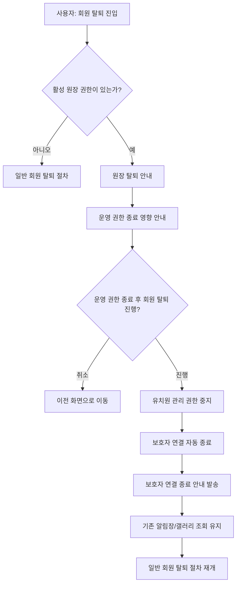
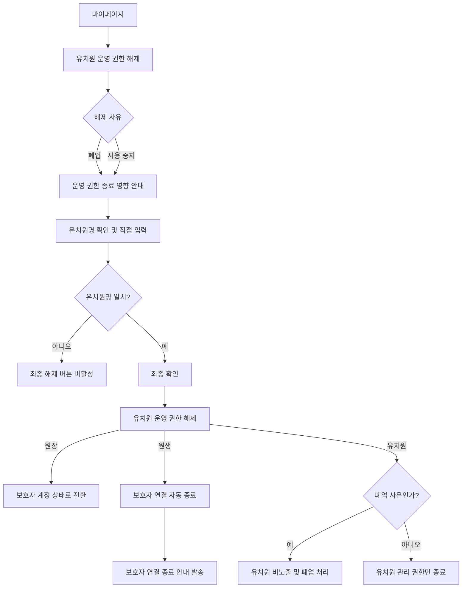

# [FR-02-5] 원장 탈퇴 및 유치원 운영 권한 종료

관련 에픽: [FR-02] 유치원 운영 기반 (https://app.notion.com/p/FR-02-37f6c15f67fb81dfa3a4fbc4310ee8ea?pvs=21)
적용 MVP: 1차 MVP
문서 상태: 최신
담당: PM_내은, UXUI_예솔
진행 단계: 디자인
기획 소요 기간: 2026년 6월 15일
위험도: ⚪ 일정 미입력
최종 편집 일시: 2026년 6월 16일 오후 2:11
비고: 2026-06-15 사용자 요청으로 계정 탈퇴 없는 유치원 운영 권한 해제 기능을 추가하고, 폐업/사용 중지/기타 사유별 처리 및 보호자 연결 종료 정책을 반영. 사용 중지 및 기타 시 유치원 기본 정보는 계속 노출.

## 1. 개요

### 목적

- 원장 권한을 가진 사용자가 일반 회원 탈퇴를 바로 진행하지 않고, 유치원 운영 권한 종료 절차를 먼저 거치게 한다.
- 원장이 계정 탈퇴 없이 특정 유치원의 운영 권한만 해제할 수 있는 절차를 제공한다.
- 운영 권한 종료/탈퇴로 인해 현재 원생의 유치원 연결 상태와 신규 기록 수신 가능 여부가 바뀌는 경우 필요한 안내를 제공한다.

### 배경

- 원장 권한은 특정 유치원의 운영 데이터와 보호자 연결에 영향을 주므로 일반 회원 탈퇴와 동일하게 처리할 수 없다.
- 원장은 유치원 운영 권한만 해제하고 보호자 측 서비스를 지속적으로 이용할 수 있어야 한다.

### 대상 사용자

| 사용자 | 상태 | 목표 |
| --- | --- | --- |
| 원장 | 유치원 관리 권한 보유 | 유치원 운영 권한 종료의 영향을 이해하고 탈퇴 또는 권한 해제를 진행한다. |
| 원장 | 계정 탈퇴 없이 유치원 운영 중지 필요 | 마이페이지에서 특정 유치원의 운영 권한만 해제한다. |
| 보호자 | 현재 재원 중인 유치원의 연결이 종료됨 | 유치원 연결 종료 사실과 기존 알림장/갤러리 조회 가능 여부를 인지한다. |

### 성공 기준

- 원장 권한이 있는 사용자는 보호자 화면에서 회원 탈퇴를 선택해도 원장 탈퇴 안내 화면으로 이동한다.
- 원장은 마이페이지에서 계정 탈퇴 없이 특정 유치원의 운영 권한을 해제할 수 있다.
- 운영 권한 해제 후 원장 계정은 유지되며 보호자 계정 상태로 전환된다.
- 폐업 사유로 운영 권한을 해제하면 해당 유치원 기본 정보는 지도 비노출 및 폐업 상태로 처리된다.
- 사용 중지 사유로 운영 권한을 해제하면 해당 유치원의 관리 권한과 보호자 연결은 종료된다.
- 보호자는 유치원 연결 종료 후에도 본인 강아지에게 이미 발행된 알림장과 공유 갤러리를 유치원 탭에서 조회할 수 있다.

---

## 2. 범위

### 포함 범위

| 범위 | 설명 | 우선순위 |
| --- | --- | --- |
| 원장 권한 보유 계정의 탈퇴 가드 | 원장 권한이 있는 사용자의 일반 회원 탈퇴를 차단하고, 유치원 운영 권한 종료 절차로 연결한다. | Must |
| 해제 사유별 유치원 상태 처리 | 폐업, 사용 중지, 기타 사유에 따라 유치원 노출 및 상태값을 처리한다. | Must |
| 운영 권한 해제 | 원장이 회원 탈퇴 없이 특정 유치원의 운영 권한만 해제할 수 있는 절차를 제공한다. | Must |
| 보호자 연결 종료 및 기록 보존 | 현재 재원 보호자의 유치원 연결을 종료하고, 이미 발행된 알림장과 공유 갤러리는 계속 조회 가능하게 한다. | Must |

### 제외 범위

| 제외 항목 | 설명 | 후속 위치 |
| --- | --- | --- |
| 교사 권한 처리 | 교사 권한 기능 | 교사 권한 추가 시 동일 해제 정책 적용 |
| 관리자 어드민 상세 화면 | 운영자용 강제 처리 및 복구 화면 | 운영 어드민 PRD |

---

## 3. 사용자 흐름

### A. 원장 계정 탈퇴

### B. 계정 탈퇴 없는 원장 운영 권한 해제

---

## 4. 상태 정의

| 상태 | 정의 | 주요 동작 |
| --- | --- | --- |
| 정상 운영 | 원장 권한이 활성이고 유치원 운영 기능을 정상 사용할 수 있는 상태 | 기존 운영 기능 사용 가능 |
| 운영 권한 해제 신청 중 | 원장이 해제 사유와 영향 안내를 확인하는 상태 | 해제 완료 전까지 기존 상태 유지 |
| 운영 권한 해제 완료 | 원장 권한과 유치원 관리 기능 접근이 종료된 상태 | 신규 초대/연결/작성 차단, 보호자 계정 상태로 전환 |
| 폐업 처리 완료 | 폐업 사유로 운영 권한이 해제되어 유치원 기본 정보가 비노출 및 폐업 처리된 상태 | 탐색 노출 중지, 보호자 연결 종료 |
| 연결 종료 보호자 | 유치원 연결은 종료되었지만 기존 알림장/갤러리를 보유한 보호자 상태 | 기존 기록 조회 가능, 신규 기록 수신 없음 |

---

## 5. 기능 요구사항

| ID | 요구사항 | 상세 | 우선순위 |
| --- | --- | --- | --- |
| KD-FR-OWNER-WD-001 | 원장 권한 탈퇴 가드 | 회원 탈퇴 진입 시 활성 원장 권한 보유 여부를 먼저 확인한다. 원장 권한이 있으면 일반 탈퇴를 막고 원장 탈퇴 안내 화면으로 이동시킨다. | Must |
| KD-FR-OWNER-WD-002 | 보호자 화면 탈퇴 진입 처리 | 사용자가 보호자 Side 또는 계정 설정에서 탈퇴를 선택하더라도 원장 권한이 있으면 동일하게 원장 탈퇴 절차로 연결한다. | Must |
| KD-FR-OWNER-WD-003 | 운영 권한 해제 진입점 제공 | 마이페이지의 `내 계정` 바로 아래에 유치원 운영 권한 해제 진입점을 제공한다. | Must |
| KD-FR-OWNER-WD-004 | 해제 대상 유치원 선택 | 원장이 관리 권한을 가진 유치원이 여러 개인 경우 해제 대상 유치원을 선택하게 한다. | Must |
| KD-FR-OWNER-WD-005 | 해제 사유 선택 | 원장은 폐업, 사용 중지, 기타를 선택할 수 있다. 기타 선택 시 사유 입력은 필수다. | Must |
| KD-FR-OWNER-WD-006 | 영향 안내 | 최종 진행 전 해당 유치원 관련 모든 권한을 잃고 보호자 계정으로 전환된다는 내용을 안내한다. | Must |
| KD-FR-OWNER-WD-007 | 유치원명 입력 확인 | 입력칸 위에 해제 대상 유치원명을 표시하고, 사용자가 동일한 유치원명을 입력해야 최종 해제 버튼을 활성화한다. | Must |
| KD-FR-OWNER-WD-008 | 운영 권한 해제 처리 | 최종 확인 후 원장의 해당 유치원 운영 권한을 해제하고 유치원 관리 기능 접근을 차단한다. | Must |
| KD-FR-OWNER-WD-009 | 보호자 계정 전환 | 운영 권한 해제 후 사용자는 보호자 계정 상태로 전환된다. | Must |
| KD-FR-OWNER-WD-010 | 권한 종료 후 기능 제한 | 운영 권한 종료 후 유치원 관리 권한을 전부 차단한다. | Must |
| KD-FR-OWNER-WD-011 | 보호자 연결 자동 종료 | 운영 권한 종료 시 현재 재원 보호자의 유치원 연결을 자동 종료한다. | Must |
| KD-FR-OWNER-WD-012 | 보호자 연결 종료 안내 | 현재 재원 보호자의 이용 상태가 변경되는 경우 앱 내 알림함 및 필수 시스템 알림으로 연결 종료를 안내한다. | Must |
| KD-FR-OWNER-WD-013 | 다른 유치원 접근 차단 | 새 유치원 또는 다른 유치원은 이전 유치원의 알림장/갤러리를 조회할 수 없다. | Must |
| KD-FR-OWNER-WD-014 | 폐업 상태 자동 처리 | 해제 사유가 폐업이면 유치원 기본 정보를 비노출하고 폐업 상태로 전환한다. | Must |
| KD-FR-OWNER-WD-015 | 상태 변경 이력 저장 | 운영 권한 종료 신청, 권한 해제, 보호자 연결 종료, 폐업 처리, 알림 발송 등 주요 상태 변경 이력을 저장한다. | Must |

---

## 6. 정책

| 정책 | 내용 |
| --- | --- |
| 원장 탈퇴 우선 원칙 | 활성 원장 권한이 있는 사용자는 일반 회원 탈퇴를 즉시 진행할 수 없다. 모든 탈퇴 진입점에서 원장 탈퇴 절차를 먼저 거친다. |
| 보호자 Side 탈퇴 가드 | 동일 계정이 보호자 화면에서 탈퇴를 선택하더라도 활성 원장 권한이 있으면 원장 탈퇴 안내 화면으로 이동한다. |
| 권한 종료 즉시성 | 운영 권한 종료 절차가 완료되면 해당 유치원 관리 권한과 신규 운영 기능은 즉시 중지된다. |
| 보호자 계정 전환 | 운영 권한 해제 후 원장 권한은 제거되고 사용자는 보호자 계정 상태로 전환된다. |
| 보호자 연결 자동 종료 | 운영 권한 종료 시 현재 재원 보호자의 유치원 연결은 자동 종료된다. |
| 과거 기록 보존 | 보호자에게 이미 발행된 알림장과 공유 갤러리는 원장 탈퇴 및 유치원 연결 종료와 관계없이 보호자 계정에서 계속 조회할 수 있다. |
| 다른 유치원 비공개 | 새 유치원이나 다른 유치원은 이전 유치원의 알림장/갤러리를 조회할 수 없다. |
| 폐업 처리 | 해제 사유가 폐업이면 유치원 기본 정보는 비노출되고 폐업 상태로 전환된다. 별도 승인 절차는 두지 않는다. |
| 사용 중지 처리 | 해제 사유가 사용 중지이면 유치원 관리 권한과 보호자 연결은 종료된다. 유치원 기본 정보는 탐색 화면에 계속 노출된다. |
| 기타 처리 | 해제 사유가 기타이면 사유 입력을 필수로 받고, 시스템 처리는 사용 중지와 동일하게 적용한다. |
| 이력 보존 | 운영 종료와 권한 변경 이력은 분쟁, 민원, 운영 대응을 위해 기록한다. |

---

## 7. 예외 및 엣지 케이스

| 상황 | 발생 조건 | 시스템 동작 | 사용자 안내 |
| --- | --- | --- | --- |
| 보호자 화면에서 탈퇴 시도 | 활성 원장 권한이 있는 계정이 보호자 Side에서 탈퇴 선택 | 일반 탈퇴 차단, 원장 탈퇴 안내로 이동 | 원장 권한이 있어 바로 탈퇴할 수 없어요. 유치원 운영 권한을 먼저 종료해 주세요. |
| 마이페이지에서 운영 권한 해제 진입 | 원장이 마이페이지의 운영 권한 해제 메뉴 선택 | 해제 대상 유치원 및 사유 선택 화면으로 이동 | 별도 안내 없음 |
| 관리 유치원이 여러 개인 경우 | 한 계정이 여러 유치원 운영 권한 보유 | 해제 대상 유치원을 먼저 선택하게 함 | 운영 권한을 해제할 유치원을 선택해 주세요. |
| 유치원명 불일치 | 입력한 유치원명이 해제 대상 유치원명과 다름 | 최종 해제 버튼 비활성 또는 오류 안내 | 유치원명을 정확히 입력해 주세요. |
| 운영 권한 해제 신청 취소 | 원장이 최종 신청 전 취소 선택 | 상태 변경 없이 이전 화면으로 이동 | 별도 안내 없음 |
| 권한 종료 후 신규 초대 시도 | 권한 종료 상태에서 보호자 초대 버튼 선택 | 초대 생성 차단 | 유치원 관리 권한이 종료되어 새 초대를 보낼 수 없어요. |
| 권한 종료 후 신규 연결 신청 | 보호자가 권한 종료 유치원에 연결 신청 | 신청 차단 또는 연결 불가 안내 | 현재 연결할 수 없는 유치원이에요. |
| 권한 종료 후 원장 홈 접근 | 운영 권한 종료 완료 후 원장 홈 진입 | 관리 홈 접근 차단 | 유치원 관리 권한이 종료되었어요. |
| 폐업 사유로 해제 | 원장이 폐업을 선택하고 최종 해제 완료 | 유치원 비노출 및 폐업 상태 처리 | 유치원 운영 권한이 해제되었어요. |
| 사용 중지 사유로 해제 | 원장이 사용 중지를 선택하고 최종 해제 완료 | 유치원 관리 권한 종료, 보호자 연결 자동 종료 | 유치원 운영 권한이 해제되었어요. |
| 현재 재원 보호자 있음 | 권한 종료로 보호자의 신규 기록 수신이 중단됨 | 보호자 연결 종료 안내 발송 | 유치원 연결이 종료되었어요. 이전에 받은 알림장과 갤러리는 계속 확인할 수 있어요. |
| 과거 기록만 보유한 보호자 | 이미 유치원 연결이 종료되어 과거 기록만 보유 | 보호자 알림 없음, 기존 기록 조회 유지 | 별도 안내 없음 |
| 기존 기록 조회 | 보호자가 종료된 유치원의 알림장/갤러리 진입 | 보호자 본인 강아지에게 발행된 기록만 조회 허용 | 별도 안내 없음 |
| 다른 유치원 조회 시도 | 새 유치원 또는 다른 유치원이 이전 유치원 기록 조회 시도 | 조회 차단 | 별도 안내 없음 |
| 시스템 처리 실패 | 종료 신청 또는 권한 종료 API 실패 | 상태 변경하지 않고 재시도 안내 | 요청을 처리하지 못했어요. 잠시 후 다시 시도해 주세요. |

---

## 8. 데이터 요구사항

| 항목 | 필수 | 설명 |
| --- | --- | --- |
| 사용자 ID | Y | 탈퇴 또는 운영 권한 해제를 시도한 사용자 식별자 |
| 원장 권한 상태 | Y | 일반 탈퇴 차단 및 원장 탈퇴 절차 연결 판단 기준 |
| 유치원 ID | Y | 운영 권한 종료 대상 유치원 식별자 |
| 유치원명 | Y | 최종 확인 화면에서 표시하고 직접 입력 검증에 사용하는 값 |
| 해제 사유 | Y | 폐업, 사용 중지, 기타 |
| 운영 권한 종료 신청 일시 | 조건부 | 운영 권한 종료 신청 시 저장 |
| 운영 권한 종료 상태 | Y | 정상 운영, 해제 신청 중, 해제 완료, 폐업 처리 완료 등 상태 |
| 권한 해제 일시 | 조건부 | 원장 권한 해제 시각 |
| 보호자 계정 전환 여부 | 조건부 | 운영 권한 해제 후 원장 권한 제거 및 보호자 계정 상태 전환 여부 |
| 기능 제한 상태 | 조건부 | 신규 초대/연결/작성 제한 여부 |
| 현재 재원 보호자 목록 | 조건부 | 연결 종료 안내 발송 대상 판단 기준 |
| 보호자 연결 종료 여부 | 조건부 | 보호자의 현재 유치원 연결 상태 변경 여부 |
| 안내 발송 이력 | 조건부 | 알림 발송 일시, 대상, 성공/실패 상태 |
| 알림장 발행 유치원 ID | 조건부 | 보호자 히스토리에서 작성/발행 유치원을 구분하기 위한 값 |
| 갤러리 공유 유치원 ID | 조건부 | 보호자 히스토리에서 공유 유치원을 구분하기 위한 값 |
| 기록 열람 권한 | Y | 보호자 본인 강아지 기록만 조회 가능하고 다른 유치원은 조회 불가함을 판단하는 권한 값 |
| 유치원 노출 상태 | 조건부 | 폐업 사유 처리 시 비노출 상태로 전환하기 위한 값 |
| 폐업 상태 | 조건부 | 폐업 사유 처리 시 폐업 완료 상태를 저장하는 값 |
| 상태 변경 이력 | Y | 신청, 권한 해제, 연결 종료, 폐업 처리, 알림 발송 등 주요 처리 이력 |

---

## 9. 시스템 메시지

| 상황 | 타입 | 문구 |
| --- | --- | --- |
| 원장 권한 보유 계정의 일반 탈퇴 진입 | Alert/Screen | 원장 권한이 있어 바로 탈퇴할 수 없어요. |
| 원장 탈퇴 안내 | Text | 유치원 운영 권한을 먼저 종료한 뒤 회원 탈퇴를 진행할 수 있어요. |
| 운영 권한 해제 영향 안내 | Text | 해제 후 해당 유치원 관련 모든 권한을 잃고 보호자 계정으로 전환돼요. |
| 기타 사유 입력 안내 | Input | 기타 사유를 입력해 주세요. |
| 유치원명 입력 안내 | Text/Input | 아래 유치원명을 정확히 입력해 주세요. |
| 유치원명 불일치 | Inline Error | 유치원명을 정확히 입력해 주세요. |
| 운영 권한 해제 확인 | Modal | 유치원 운영 권한을 해제할까요? |
| 운영 권한 해제 완료 | Complete | 유치원 운영 권한이 해제되었어요. |
| 권한 종료 후 접근 | Alert/Text | 유치원 관리 권한이 종료되었어요. |
| 처리 실패 | Toast/Alert | 요청을 처리하지 못했어요. 잠시 후 다시 시도해 주세요. |
| 보호자 연결 종료 안내 | Push/Inbox | 유치원 연결이 종료되었어요. 이전에 받은 알림장과 갤러리는 계속 확인할 수 있어요. |

---

## 10. 확인 필요 사항

| 항목 | 확인 필요 내용 | 영향 범위 |
| --- | --- | --- |
| 복구 정책 | 오입력 또는 실수로 운영 권한을 해제한 경우 복구 가능 여부와 처리 주체 확정 필요 | 정책, 운영, BE |
| 알림장 수정/삭제 권한 | 원장 권한 종료 후 이전 알림장/갤러리를 수정 또는 삭제할 수 있는 주체를 확정 필요 | 정책, 운영, 개발 |

---

## 11. 원본 및 변경 반영

| 구분 | 내용 |
| --- | --- |
| 참고 원본 | 서비스 정책서 `kd-data-07`, `kd-place-07-1`, [FR-02-1] 유치원 관리 권한 획득, [FR-02-2] 유치원 정보 관리, [FR-02-4] 원장 홈 대시보드 |
| 반영 변경 | 계정 탈퇴 없는 유치원 운영 권한 해제 기능 추가. 진입 위치는 마이페이지 `내 계정` 바로 아래로 정의. 해제 사유는 폐업/사용 중지/기타로 구분하고, 기타 선택 시 사유 입력을 필수로 반영. 폐업 사유는 유치원 기본 정보 비노출 및 폐업 상태로 자동 처리하고, 사용 중지와 기타 사유는 유치원 기본 정보를 계속 노출하도록 반영. |
| 반영 변경 | 보호자 연결 자동 종료, 기존 알림장/갤러리 조회 유지, 보호자 연결 종료 안내 문구를 반영. |
| 작성일 | 2026-06-15 |